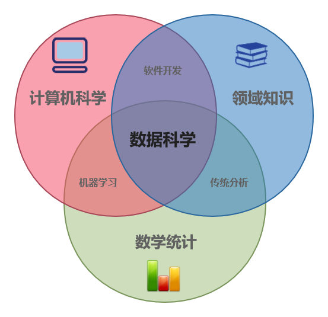

# R语言介绍

## 数据科学

### 数据科学的定义

数据科学是一门使用现代信息技术和工具来处理大量数据，从而发现数据中潜在的的模式并获取有意义的信息从而做出实际业务中的关键决策的研究领域。它基于传统的数学统计知识和现代快速发展的信息科技，使用复杂的机器学习算法针对相关领域的实际问题来建立相关模型并进行挖掘和分析，是一个高度综合、交叉的学科。也正是因为其高度的学科交叉特性，数据科学可以结合数理统计、数据分析、机器学习和专业知识等多方面信息，从已有的数据中挖掘出常规学科无法获取的知识。数据科学的生命周期包括捕获、维护、处理、分析和最终的交流，可以辅助决策者做出明智准确的商业判断。

### 数据科学与计算机科学、数理统计、机器学习等概念的区别

计算机科学是研究计算、自动化和信息的科学，其跨越理论学科(如算法、计算理论、信息论和自动化)到实践学科(包括硬件和软件的设计和实现)，核心问题是算法和数据结构。

数理统计学是应用数学的一个分支，涉及从定量数据中收集、描述、分析和推论结论，其背后的数学理论很大程度上依赖于微积分、线性代数和概率论。

专业知识又被称为经验、知识，是人类在实际生产活动中从实践中获得的经验和知识，他们往往是常规场景下进行判断和决策的重要依据。

学科的交叉融合可以产生新学科，机器学习和数据科学等就由此而来。基于已有的知识和经验，使用统计学手段研究实际问题是传统分析；利用计算机科学和专业知识解决问题的过程被称为软件开发；计算机科学与数理统计相结合则产生了机器学习。而数据科学，则是融合数理统计、计算机科学和专业知识等为一体的高度交叉学科。

### 数据科学的重要价值

随着科技的不断进步，现代技术能够产生和存储越来越多的信息，数据量呈现爆炸式增长，许多公司都因此拥有极为丰富的数据宝库。据估计，目前世界上90%的数据都是在过去两年内产生的，比如Facebook用户每小时可以上传高达1000万张图片，微信每天有多达450亿次消息发送，有约4.1亿次音视频呼叫成功。但遗憾的是，公司所产生的绝大部分数据都往往只是存放在数据仓库中，无法得到有效利用。

事实上，通过已有技术收集和存储的大量数据可以为世界各地的组织和社会带来变革性的好处-但前提是我们能够处理和解释这些数据，这就是数据科学的用武之地。数据科学可以用于揭示数据中蕴含的趋势和规律，进而辅助企业决策层做出更好的决策，创造更多创新的产品和服务。更加重要的是，数据科学可以利用机器学习模型从海量的数据输入中不断学习新的知识，这相比传统的业务模式-主要依赖于业务分析人员从少量数据中得到新发现新知识，有巨大的优势。因此，数据是创新的基石，但它的价值来自其中蕴含的信息和规律，而这个过程离不开数据科学。

### 数据科学的生命周期

数据科学的生命周期主要分为五个独立的阶段，每一阶段都有其特定的任务。

+ 捕获：捕获阶段主要集中在收集结构化和非结构化的数据，包括数据采集、数据输入、信号接收和数据提取等。

+ 维护：维护阶段主要是获取原始数据，并进行一定程度的预处理，然后将数据以方便实用的形式妥善保存在安全的介质中。包括建立和维护数据仓库、数据清洗、数据分级、数据预处理、设计数据架构等。

+ 处理：处理阶段主要是数据科学家基于准备好的数据，检查数据模态、范围和偏差来决定数据在实际应用中的有效性。包括数据建模和数据汇总等。

+ 分析：分析是数据科学中的主要阶段之一，涉及到对数据的探索性或验证性分析，进行数据分析和数据挖掘。包括预测分析、回归分析、文本挖掘等。

+ 交流：交流是数据科学生命周期的最后一阶段，分析人员以易于理解和阅读的方式（如图表和报告等）汇报和讲解分析结果。包括数据可视化、商务决策等。

## R语言简介与Rstudio

R语言是用于统计计算和绘图的免费软件。它可以在Windows, Unix以及MacOS等系统下运行。用户可以从网上免费下载R语言。

R是由Ross Ihaka和Robert Gentleman在1993年开发的一种编程语言，现在由R开发核心团队负责开发。R语言的起源可以追溯到80年代，那时候的AT&T贝尔实验室（也就是现在的朗讯科技）开发了S语言进行数据挖掘、统计分析和绘图。S语言后来演变成为了商业软件S-Plus。后来有一些志愿者将S-Plus改进成为免费的R语言。R语言的统计功能强大，包括线性和非线性模型，经典统计检验、时间序列分析、聚类分析等等，并且具有高度的可扩展性。

R语言是一个自由、免费、开源的软件。在自由软件基金会的GNU通用公共许可证的条款下，R是以源代码形式提供的自由软件。它可以在各种UNIX平台和类似系统（包括FreeBSD和Linux）、Windows和MacOS上编译和运行。另外，R语言的编程简单易学。你可以自己写函数，将最新的统计方法应用到R语言中去。R语言的函数和数据集都保存在程序包里面。当我们需要访问这些函数和数据时，需要下载相关的程序包。

除此之外，R还具有顶尖的绘图功能。尤其对于复杂数据的可视化问题，R的优势更加明显。一方面，R中各种绘图函数和绘图参数的综合使用，可以得到各式各样的图形结果，无论对于常用的直方图、饼图、条形图等，还是复杂的组合图、地图、热图、动画，以及自己脑子里突然想到的其他图形展现方式，都可以采用R语言实现。另一方面，从数值计算到得到图形结果的过程灵活，一旦程序写好后，如果需要修改数据或者调整图形，只需要修改几个参数或者直接替换原始数据即可，不用重复劳动。这对需要绘制大量同类图形的用户比较适用。例如，某用户需要观察某一因素与其他100个因素的交互关系，可以绘制100个条形图或走势图。配合R的循环和条形图功能，可以很快得到jpg、png、bmp、tiff、gif或postscript等格式的图形结果。

RStudio是R语言的集成开发环境(IDE)，它是一个独立的开源项目，它将许多功能强大的编程工具集成到一个直观、易于学习的界面中，包括控制台、语法高亮编辑器，支持直接执行代码，以及绘图、历史、调试和工作区管理的工具。

* IDE的主要组件都很好地集成到一个四面板布局中，其中包括用于交互式R会话的控制台、用于组织项目文件的带选项卡的源代码编辑器，以及用于组织较少中心组件的带笔记本的面板。

* 源代码编辑器功能丰富，并与内置控制台集成。

* 通过选项卡完成和帮助页面查看器组件，控制台和源代码编辑器与R的内部帮助系统紧密相连。

* 设置不同的项目很容易，在它们之间进行切换甚至更容易。

* RStudio提供了许多方便且易于使用的管理工具，用于管理包、工作区、文件等。

* IDE可用于三种主要操作系统，可以通过web浏览器进行远程访问。

* RStudio比Emacs/ESS更容易学习，比Emacs/ESS更容易配置和安装

* Eclipse/StatET拥有比JGR更好的编辑器，比JGR更有组织性

* Sciviews不同于notepad++和RGui，它可以在更多的平台上使用，而不只是windows。

RStudio可以在所有主要平台(Windows、Mac、Linux)上运行，也可以通过web浏览器(使用服务器安装，连接到RStudio Server或RStudio Workbench（Debian/Ubuntu、Red Hat/CentOS和SUSE Linux）的浏览器中)运行。

## Tidyverse简介

  Tidyverse是R语言的一个程序包，是由伟大的Hadley Wickham和他的团队创建的，目的是提供所有这些工具来清理和处理数据。Tidy的意思是干净、整洁。Verse的意思是诗歌、歌曲。那么Tidyverse的意思就是干净整洁的语句。

  Tidyverse可以大大简化数据处理和分析，它有八个核心软件包，分别是ggplot2、dplyr、tidyr、readr、purrr、tibble、stringr和forcats。所有这些包都是通过install.packages("tidyverse")命令一次性自动加载的。除了这些包之外，Tidyverse还有一些特殊的包，它们不是自动加载的，而是需要自己调用的。这些包括用于关系数据库的DBI。用于网络API的httr，用于网络刮削的rvest，等等。

### 数据可视化和探索
#### ggplot2
ggplot2是一个基于The Grammar of Graphics的R数据可视化库。ggplot2可以使用高级API创建数据可视化，如柱状图、饼图、柱状图、散点图、误差图等。它还允许你在单个可视化中添加不同类型的数据可视化组件或层。一旦ggplot2被告知哪些变量要映射到图中的哪些美学，它就会完成剩下的工作，这样用户就可以专注于解释可视化，而在创建可视化时花费更少的时间。但这也意味着不可能在ggplot2中创建高度定制的图形。但在RStudio社区和Stack Overflow中有很多资源，可以在需要时提供ggplot2的帮助。

### 数据处理和转换
#### dplyr
dplyr是R语言中一个非常流行的数据处理库，它有五个重要的函数，与group_by()函数自然结合，可以帮助分组执行这些函数。这些函数包括mutate()函数，它可以添加新的变量，这些变量是现有变量的函数，select()函数根据变量的名称选择变量，filter()函数根据变量的值选择变量，summaryise()函数将多个值缩减为一个摘要，arrange()函数安排排列行的顺序。

#### tidyr
tidyr是R语言中的一个数据清理库，它有助于创建整洁的数据。整齐的数据意味着所有的数据单元都有一个单一的值，每一列数据都是一个变量，每一行数据都是一个观察值。这种整洁的数据是tidyverse的主要内容，它确保了更多的时间花在数据分析和从数据中获取价值上，而不是不断地清洗数据和修改工具来处理不整洁的数据。tidyr中的功能大致分为五类，即：透视，在长形和宽形之间改变数据；嵌套，改变分组数据，使一个组成为具有嵌套数据框架的单行；拆分字符列，然后合并它们。将嵌套的列表转换为整齐的二维码，并将隐式缺失值转换为显式值。

#### stringr
stringr是一个库，有许多用于数据清理和数据准备任务的功能。它也是为处理字符串而设计的，并且有许多函数使这一过程变得简单。stringr是建立在stringi之上的，而stringi是International Components for Unicode C库。因此，如果有任何你想使用但在stringr中找不到的函数，那么最好的地方就是stringi。这也意味着，一旦你掌握了stringr，stringi的使用就不那么困难了，因为这两个包都有类似的约定。stringr中的所有函数都以str开头，它们接受一个字符串向量作为其第一个参数。其中一些函数包括str_detect(), str_extract(), str_match(), str_count(), str_replace(), str_subset()，等等。 

#### forcats
forcats是一个R库，主要是处理与向量有关的问题。这些向量是有一组固定的可能取值的变量，这些值是事先知道的。所以forecats处理的问题包括改变向量中的值的顺序，重新排序向量等。forcats中的一些函数是fct_relevel()，它通过手工对向量进行排序，fct_reorder()使用另一个变量对一个因子进行排序，fct_infreq()通过频率值对一个因子进行排序等等。

### 数据导入和管理

#### tibble
tibble是data.frame的一种形式，它包括了其中有用的部分，而抛弃了不太重要的部分。所以tibbles不会像data.frame那样改变变量的名称或类型，也不会做部分匹配，但它们能更快地将问题暴露出来，例如当一个变量不存在时。因此，使用Tibbles的代码要比以前干净和有效得多。Tibbles也更容易用于包含更复杂对象的更大的数据集，部分原因是增强了print()方法。你可以使用tibble()函数从列向量创建新的tibbles，你也可以使用tribble()函数逐行创建一个tibble。

#### readr
这个库提供了一个简单而快速的方法来读取矩形数据，如文件格式tsv, csv, delim, fwf等。readr可以使用一个解析整个文件的函数和另一个专注于特定列的函数来解析许多不同类型的数据。这个列规范定义了将该列中的数据从字符向量转换为最适合的数据类型的方法。在大多数情况下，这是 readr 自动完成的。 readr 可以使用不同的函数读取不同类型的文件格式，即 read_csv() 用于逗号分隔的文件，read_tsv() 用于标签分隔的文件，read_table() 用于表格文件，read_fwf() 用于固定宽度的文件，read_delim() 用于分隔文件，以及，read_log() 用于网页日志文件。

### 功能性编程

#### purrr
Purrr是一套详细的函数和向量工具，它主要用于管理R语言中的函数式编程。一个很好的例子是map()函数，它被用来取代多个for循环，这些for循环使代码变得复杂和混乱，从而使代码更简单，易于阅读。除此之外，所有的purrr函数都是类型稳定的，这意味着它们要么返回宣传的输出类型，如果不可能，则会给出一个错误。

## R语言包

R包是由社区开发的函数和数据集的集合。它们通过改进现有的基本R功能或增加新的功能来提高R的能力。例如，如果你经常处理数据框架，你可能听说过dplyr或data.table这两个最流行的R包。

R的基本安装包含了许多有用的标准包。这些包将包含许多你每天都会用到的功能。然而，当你开始在更多的项目中使用R时（以及你自己对R的使用也在不断发展），你会发现有一天你需要扩展R的功能。

令人高兴的是，成千上万的R用户已经开发出了有用的代码，并以可安装包的形式分享这些代码。你可以把包看作是一个函数、数据和帮助文件的集合，它被整理成一个定义良好的标准结构，你可以在R中下载和安装。这些包可以从各种来源下载，但最流行的是CRAN、Bioconductor和GitHub。目前，CRAN承载了超过15000个软件包，是用户贡献的R软件包的官方存储库。

Bioconductor提供了面向生物信息学的开源软件，托管了1800多个R包。GitHub是一个为各种软件和项目（不仅仅是R）托管git仓库的网站。通常，R包的尖端开发版本都托管在GitHub上，所以如果你需要所有的新功能，那么这可能是一个选择。然而，使用R包的开发版本的一个潜在缺点是，它可能不像CRAN上的版本那样稳定（它正在开发中！），而且更新包不会自动进行。

## R语言常用快捷键

* 显示所有快捷键 ：如果想看所有快捷键，可按alt + shift + k；或者在界面中点击Tools + Keyboard Shortcuts Help。
* 快速运行：
    * ctrl + alt + R 运行该脚本所有代码
    * ctrl + Enter 运行当前鼠标所在行代码
* 新建脚本：Ctrl+Shift+N 快速新建脚本
* 多行注释：先选中所要注释的代码，然后按ctrl + shift + c。如果想取消注销，再选中代码，再后ctrl + shift + c
* 代码折叠与展开：有时候在函数的时候，或者Rmarkdown写代码行时，发现内容很多想把它折叠起来，这时候就可以用这个快捷键。
    * alt + o    折叠所有文件夹
    * alt + shift + o    展开所有文件夹
    * alt + L    折叠当前文件夹
    * alt + shift + L    展开当前文件夹
    * 注意：这里的o不是指数字0。
* 管道函数：ctrl + shift + M
* 赋值 ：<- 怎么打？快捷键：alt + -
* 帮助help：如果遇到函数搞不懂这个函数什么意思，将光标放到函数中间，然后按F1键即可查看函数细节，或者?函数。
* 复制并粘贴代码：shift+Ctrl+D 在一行代码末尾或者选中一堆代码后使用更佳
* 设置工作路径：按快捷键ctrl + shift + H之后显示当前目录，你可以选择其他路径作为当前目录。或者可以通过窗口操作，点击Sessin中的Set Working Directory
* 搜索历史记录：假如想找以前提交的命令怎么办？在控制台中，通过 Ctr + [向上箭头]可以搜索到历史记录。或者通过窗口操作，右上角有个History，点击即可
* 创建可折叠注释：Ctrl + Shift + R
* 重启RStudio中的R：ctrl + shift + F10  运行代码卡住时可以使用
* 函数提取：如果你已经写了一段代码，你想把它转换成一个函数，则可以输入Ctrl + Alt + X，这时会出现一个弹出窗口，要求你输出一个函数名

**控制台Console**

|Description| Windows &Linux | Mac |
|:---:|:---:|:---:|
|将光标定位到控制台|   Ctrl+2  | Command+2 |
|清空控制台|   Ctrl+L|  Command+L|
|将光标定位到行首|    Home  |  Command+Left|
|将光标定位到行末|    End| Command+Right|
|在历史命令中导航|    Up/Down| Up/Down|
|弹出历史命令框| Ctrl+Up| Command+Up|  
|中断当前命令的执行|   Esc| Esc|
|改变工作目录|  Ctrl+Shift+K|    Ctrl+Shift+K|

**Source**

|Description| Windows & Linux | Mac|
|:---:|:---:|:---:|
|跳转到文件/函数|    Ctrl+.|  Ctrl+.|
|光标定位到源码编辑器 | Ctrl+1|  Ctrl+1|
|新建一个文件 | Ctrl+Shift+N  |  Command+Shift+N|
|打开文件 |   Ctrl+O|  Command+O|
|保存当前文件 | Ctrl+S|  Command+S|
|关闭当前文件 | Ctrl+W|  Command+W|
|关闭当前文件(仅适用于Chrome)|  Ctrl+Shift+Z  |  Command+Shift+Z|
|关闭所有打开的文件|   Ctrl+Shift+W  |  Command+Shift+W|
|在HTML里面预览  | Ctrl+Shift+Y  |  Command+Shift+Y|
|Knit to HTML |   Ctrl+Shift+H|    Command+Shift+H|
|编译PDF (TeX and Sweave)|  Ctrl+Shift+I|    Command+Shift+I|
|插入块| Ctrl+Alt+I|  Command+Option+I|
|插入代码段|   Ctrl+Shift+R  |  Command+Shift+R|
|运行当前/被选中的代码| Ctrl+Enter|  Command+Enter|
|再次运行以前区域|    Ctrl+Shift+P|    Command+Shift+P|
|运行当前文件|  Ctrl+Alt+R|  Command+Option+R|
|运行文件中从开头到光标所在处的代码|   Ctrl+Alt+B|  Command+Option+B|
|运行文件中从光标所在处到文件末尾的代码| Ctrl+Alt+E|  Command+Option+E|
|运行当前函数定义代码|  Ctrl+Alt+F|  Command+Option+F|
|运行当前代码块| Ctrl+Alt+C|  Command+Option+C|
|运行下一个代码块 |   Ctrl+Alt+N|  Command+Option+N|
|执行一个外部文件中的代码 |   Ctrl+Shift+O  |  Command+Shift+O|
|执行当前文件中的代码|  Ctrl+Shift+S|    Command+Shift+S|
|执行当前文件中的代码（并输出）| Ctrl+Shift+Enter  |  Command+Shift+Enter|
|折叠选中代码|  Alt+L|   Command+Option+L|
|打开选中代码|  Shift+Alt+L| Command+Shift+Option+L|
|折叠所有代码|  Alt+0|   Command+Option+0|
|打开所有代码|  Shift+Alt+0| Command+Shift+Option+0|
|跳转到指定行|  Shift+Alt+G| Command+Shift+Option+G|
|跳转到| Shift+Alt+J| Command+Shift+Option+J|
|切换tab|   Ctrl+Alt+Down|   Ctrl+Option+Down|
|切换到前一个tab|   Win: Ctrl+Alt+Left, Linux: Ctrl+PageUp | Ctrl+Option+Left|
|切换到下一个tab|   Win: Ctrl+Alt+Right, Linux: Ctrl+PageDown |  Ctrl+Option+Right|
|切换到第一个tab|   Ctrl+Shift+Alt+Left| Ctrl+Shift+Option+Left|
|切换到最后一个tab|  Ctrl+Shift+Alt+Right|    Ctrl+Shift+Option+Right|
|向前切换（类似浏览器→）|    Ctrl+F9| Command+F9|
|向后导航（类似浏览器←） |   Ctrl+F10  |  Command+F10|
|Reindent lines|  Ctrl+I|  Command+I|
|从选中的代码中提取函数| Ctrl+Shift+U|    Command+Shift+U|
|注释/取消注释 当前行/选中区域 |   Ctrl+Shift+C  |  Command+Shift+C|
|Reflow comment|  Ctrl+Shift+/  |  Command+Shift+/|
|Transpose Letters|   　   Ctrl+T|Ctrl+T|
|向上/向下移动一行|   Alt+Up/Down| Option+Up/Down|
|Copy Lines Up/Down|  Ctrl+Alt+Up/Down|    Command+Option+Up/Down|
|Jump to Matching Brace/Paren|    Ctrl+P|  Ctrl+P|
|查找并替换|   Ctrl+F|  Command+F|
|查找下一个|   Win: F3, Linux: Ctrl+G  |Command+G|
|查找上一个|   Win: Shift+F3, Linux: Ctrl+Shift+G|  Command+Shift+G|
|替换并查找|   Ctrl+=|  Command+=|
|在文件中查找|  Ctrl+F|  Command+F|
|拼写检查|    F7|  F7|

**Editing (Console and Source)编辑**

|Description| Windows & Linux| Mac|
|:---:|:---:|:---:|
|撤销|  Ctrl+Z|  Command+Z|
|重复上次操作 | Ctrl+Shift+Z|    Command+Shift+Z|
|剪切|  Ctrl+X|  Command+X|
|复制|  Ctrl+C|  Command+C|
|粘贴|  Ctrl+V|  Command+V|
|全选 | Ctrl+A|  Command+A|
|跳转到单词|   Ctrl+Left/Right| Option+Left/Right|
|跳转到开头/结尾|    Ctrl+Home/End or Ctrl+Up/Down|   Command+Home/End or Command+Up/Down|
|删除行| Ctrl+D|  Command+D|
|选择 | Shift+[Arrow] |  Shift+[Arrow]|
|选择一个词|   Ctrl+Shift+Left/Right |  Option+Shift+Left/Right|
|选中光标处到行首的内容| Shift+Home|  Command+Shift+Left or Shift+Home|
|选中光标处到行末的内容| Shift+End |  Command+Shift+Right or Shift+End|
|Select Page Up/Down| Shift+PageUp/PageDown|   Shift+PageUp/Down|
|选中到文件开始/末尾的内容|   Ctrl+Shift+Home/End or Shift+Alt+Up/Down|    Command+Shift+Up/Down|
|删除左边的单词| Ctrl+Backspace|  Option+Backspace or Ctrl+Option+Backspace|
|删除右边的单词 |　|   Option+Delete|
|删除光标到行末的内容|  　   Ctrl+K||
|删除光标到行首的内容||  　   Option+Backspace|
|缩进|  Tab (at beginning of line)|  Tab (at beginning of line)|
|取消缩进   | Shift+Tab |  Shift+Tab|
|Yank line up to cursor|  Ctrl+U|  Ctrl+U|
|Yank line after cursor | Ctrl+K|  Ctrl+K|
|Insert currently yanked text |   Ctrl+Y  |Ctrl+Y|
|Insert assignment operator|  Alt+-|   Option+-|
|查看光标处的函数帮助|  F1|  F1|
|查看光标处的函数代码|  F2|  F2|

**Completions (Console and Source)补全**

|Description| Windows & Linux| Mac|
|:---:|:---:|:---:|
|自动完成|    Tab or Ctrl+Space |  Tab or Command+Space|
|在历史命令中导航|    Up/Down| Up/Down|
|选定命令|    Enter, Tab, or Right  |  Enter, Tab, or Right|
|离开弹出的自动完成提示框|    Esc| Esc|

**Views视图**

|Description| Windows & Linux| Mac|
|:---:|:---:|:---:|
|跳转到文件/函数 |   Ctrl+.|  Ctrl+.|
|将光标定位到代码编辑器| Ctrl+1  |Ctrl+1|
|将光标定位到控制台|   Ctrl+2|  Ctrl+2|
|将焦点定位到帮助 |   Ctrl+3|  Ctrl+3|
|显示历史 |   Ctrl+4|  Ctrl+4|
|显示文件 |   Ctrl+5|  Ctrl+5|
|显示图像 |   Ctrl+6|  Ctrl+6|
|显示包| Ctrl+7|  Ctrl+7|
|显示工作空间 | Ctrl+8  |Ctrl+8|
|显示Git/SVN  | Ctrl+9  |Ctrl+9|
|显示Build| Ctrl+0  |Ctrl+0|
|同步编辑器和PDF预览 |Ctrl+F8| Command+F8|

**Build**

|Description| Windows & Linux| Mac|
|:---:|:---:|:---:|
|编译和重载|   Ctrl+Shift+B  |  Command+Shift+B|
|加载所有(devtools)|  Ctrl+Shift+L  |  Command+Shift+L|
|检查包| Ctrl+Shift+E  |  Command+Shift+E|

**Plots绘图**

|Description| Windows & Linux| Mac|
|:---:|:---:|:---:|
|上一个图像|   Ctrl+Shift+PageUp |  Command+Shift+PageUp|
|下一个图像|   Ctrl+Shift+PageDown| Command+Shift+PageDown|
|显示操作者|   Ctrl+Shift+M  |  Command+Shift+M|

**Git/SVN**

|Description| Windows & Linux| Mac|
|:---:|:---:|:---:|
|对比当前源码文件 |   Ctrl+Shift+D|    Command+Shift+D|
|提交修改|    Ctrl+Shift+M|    Command+Shift+M|
|滚动查看不同 | Ctrl+Up/Down|    Ctrl+Up/Down|
|Stage/Unstage (Git)| Spacebar|    Spacebar|
|Stage/Unstage and move next (Git)|   Enter|   Enter|

## 数据分析与挖掘流程

### 数据分析

数据分析是一个检查、清理、转换和建模数据的过程，目的是发现有用的信息，为结论提供依据，并起到辅助决策过程的作用。数据分析包含多个方面和多种方法，包括不同名称下的各种技术，并用于不同的商业、科学和社会科学领域。在当今的商业世界中，数据分析在做出更科学的决策和帮助企业更有效地运营方面发挥着重要作用。

### 数据分析流程

总体来说，数据分析是一个获取原始数据然后将其转化为对决策者用用的信息的过程，主要包含八个阶段.

+ 数据要求：数据作为分析流程的输入时必须的，而且是根据指导分析的人(或将使用分析产生的最终产品的客户)的需求指定的。数据可以是数字的，也可以是分类的(比如数字的文本标签)。

+ 数据收集：数据可以从各种来源收集，根据数据分析者所处的专业领域不同而变化。一般而言，原始数据可从环境中的传感器收集，包括交通摄像机、卫星、记录设备等，比如足球和篮球等体育数据可以通过摄像传感器记录保存。如果对数据的质量要求不高，也可以选择通过文档、图标等网络资源中获取二手乃至多手数据。

+ 数据处理：最初获得的数据必须经过标准化处理以进行分析。例如，最常见数据处理要求就是以表格形式(称为结构化数据)将数据放入行和列中以供进一步分析，通常是通过使用电子表格或统计软件来进行。

+ 数据清洗：经过数据处理后，所得到的结构化数据可能是不完整的，也可能存在冗余和错误等情况，这往往可能是因为数据输入和存储的方式存在问题，因此需要对数据进行数据清洗，从而防止和纠正这些错误。数据清洗常见的任务包括记录匹配、识别不准确数据、判断现有数据的整体质量、删除重复数据和识别异常数据。比如常见的异常值检测定量数据方法可以用于去除异常数据。

+ 数据探索性分析：数据集被清理干净后，就可以开展多种类型的探索性分析。分析人员可以应用包括统计学方法在内的各种技术，称为探索性或者描述性数据分析，来理解所获得的数据中包含的基本信息。常见的可以利用最基本的数据统计量，即平均数、中位数和众数等来了解数据的基本统计学描述。

+ 数据建模分析：可以利用相关数理统计模型或者机器学习算法来对数据分析，进而确定变量之间的关系，这是对数据进行深入建模分析的过程。一般来说，模型可以根据数据集中包含的其他变量来评估特定的变量，但是模型与数据之间往往会存在一定的偏差数据=模型+误差，例如使用回归模型探索某个变量与其他所有变量之间的相关关系，分析人员往往用残差来代表数据和模型之间的误差。

+ 数据产品：数据产品一般是一种基于某种模型或算法的计算机应用程序，它接受数据输入并生成输出，然后将它们反馈给环境。例如，一个分析客户购买历史数据的应用程序，可以基于其底层的推荐算法为客户推荐其可能喜欢的其他商品。

+ 数据交流：数据分析完成之后，可能以多种格式报告给需求方客户，以支持其相关决策。另一方面，客户可能会对数据分析的结果产生反馈，从而产生额外的数据分析需求，这也是为什么很多数据分析流程呈现周期性、迭代性特征。

### 数据挖掘

数据挖掘是在大规模数据集中提取和发现模式和规律的过程，是涉及机器学习、数理统计和数据库系统的交叉方法，也是计算机科学和统计学的一个跨学科交叉领域。数据挖掘总体目标是从数据集中提取潜在的信息和模式，并将信息转化为可理解的结构以供进一步使用。实际的数据挖掘任务是对大量数据进行半自动或自动分析，以提取以前未知的、有趣的模式，如数据集群发现(聚类分析)、异常记录(异常检测)和依赖性(关联规则挖掘、顺序模式挖掘)。数据分析最常用的六类任务分别是：

+ 异常检测：异常检测又称异常值/偏差检测，需要识别出有待进一步调查的数据错误。

+ 关联规则学习：关联规则学习是对依赖性建模的过程，用于探索变量之间的关系。比如，一家超市可能会收集有关顾客购买习惯的数据，然后用通过关联规则学习，可以确定哪些产品经常被一起购买，并将这些信息用于营销。

+ 聚类：聚类是在不使用数据中的已知结构的条件下，发现数据中相似的集群或者社区的任务。

+ 分类：分类是将已知结构一般化以应用于新数据的任务。例如，一个电子邮件程序可能根据历史垃圾邮件记录，试图将一封电子邮件分类为“合法”或“垃圾邮件”。

+ 回归：回归试图找到函数，该函数在某种误差最小度量下对数据进行拟合建模，比兔线性回归和逻辑回归等。

+ 总结：提供更紧凑的数据集表示，包括可视化和报告生成。

### 数据挖掘流程

按照跨行业数据挖掘标准流程(CRISP-DM)，一般数据挖掘的流程分成六个阶段，包括业务背景了解、数据理解、数据准备、建模、评价和部署。其基本过程与数据分析流程类似，这里不再赘述。

### 数据分析与数据挖掘的比较

数据分析和数据挖掘的区别在于，数据分析用于测试数据集上的模型和假设，例如，分析营销活动的有效性，并且数据分析往往不考虑数据量。相比之下，数据挖掘使用机器学习和统计模型来揭示大量数据中的秘密或隐藏模式，即数据挖掘一方面更侧重于发现未知模式，另一方面往往侧重于应用于大数据。
