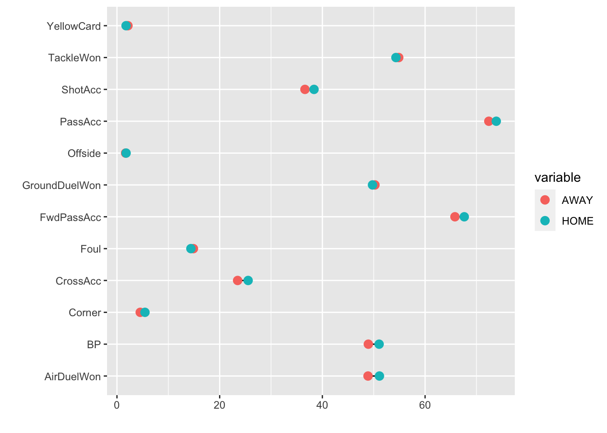

# 数据可视化

## R语言中的图形系统

R语言中主要包含了三种图形系统，分别是基于graphics、基于lattice和基于ggplot2的图形系统。其中基本图形系统通过graphics包来实现，而基于lattice包和基于ggplot2的图形系统则都是在grid包的基础之上实现的。R-base中已经包含了graphics、grid和lattice三个包，因此不需要另外下载，而ggplot2则需要使用者自行安装。作为R-base原生图形系统，graphics无需加载即可使用，而grid、lattice和ggplot2则需要加载才可使用。

graphics绘图的特点是从空白版面开始绘图，图中的每一个元素都需要绘图者进行设计，因此绘图时需要对要绘制的内容有较为清晰的认识和计划。从函数的角度而言，graphics的绘图一般主要包括两个步骤，第一步是选择合适的图形主体，比如散点图`plot`、分布图`hist`和箱线图`boxplot`等等，第二步是在绘图主体上进行进一步的修饰和美化。

grid包可以非常方便的控制图形基本单元，为编程者创造图形提供较大的方便。例如，grid包可以产生供编程者编辑的图形组件，这些图形组件可以被重复使用或重组，并通过`grid.layout()`等函数把图形输出到指定位置。grid包的局限在于其没有提供生成统计图形和完整绘图的函数，因此编程者往往不会直接使用grid包来分析和展示数据。

lattice基于grid包实现，可以在多个维度下展示数据，即通过所谓的栅栏(trellis)来对多元变量关系进行直观展示。相较于基本绘图系统，lattice直接在图形设备上进行绘图，相应的绘图函数会返回栅栏对象。在命令执行时，栅栏对象会被自动打印，因此看起来像是lattice()函数直接完成了绘图过程。

ggplot2提供了一种全面而新颖的绘图方式，这套图形语法将绘图过程归结为数据(data)、视觉映射(Aesthetics)、几何对象(Geometries)、分面(Facets)、统计变换(Statistics)、坐标系统(Coordinates)和主题(Theme)等一系列步骤，并通过各步骤间的灵活组合完成统计绘图。在ggplot2包中，加号(+)的引入是变革性的，因为其使得各图层之间可以进行灵活的组合。相较于R中基于graphics和lattice包的参数繁多的的绘图系统，ggplot2摒弃了诸多繁琐的细节，以“图层叠加”的简单绘图逻辑提供了人性化而又高质量的绘图方法。

这里以散点图、箱线图和直方图为例展示三种绘图系统的具体代码，如下表所示，其中df是一个包含height, class和distance三列的数据框，分别代表身高，班级和跳远距离：

| 图形语法 | 散点图 | 箱线图 | 直方图 |
| :--------: | :------: | :------: | :------: |
| graphics | plot(df\$height, df\$distance) | boxplot(distance~class, data=df, xlab="class", ylab="distance") | hist(df\$distance, breaks=5, ylim=(0, 40)) |
| lattice | xyplot(height~distance, df, col="black") | bwplot(distance~class, df, xlab="class", par.setttings=canonical.theme(color=FALSE)) | histogram(~distance, df, type="count", nint=5, col=""white"") |
| ggplot2 | ggplot(df, aes(x=height, y=distance)) + geom_point() | ggplot(df, aes(x=class, y=distance)) + geom_boxplot() | ggplot(df, aes(SOD) + geom_histogram(bins=30, colour="black", fill="white")) |

可以看到基于graphics和lattice的图形系统的不足在于参数繁多和绘图逻辑不清晰，而ggplot2的绘图逻辑清晰，设置灵活，因此本书将以ggplot2为主介绍R语言的数据可视化。

## ggplot2语法结构------七层结构

### 第一层：数据（Data）

选择要分析的数据集 +ggplot(data = )

### 第二层：视觉映射（Aesthetics）
视觉映射的目的是完成x轴变量和y轴变量的选取
所谓映射，就是数据集中的数据关联到相应的图形属性过程中一种对应关系。
+aes(x = , y = )

### 第三层：几何对象（Geometries）

使用几何函数来指定变量如何在视觉上进行表示（使用点、条、线和阴影区，多边形）
选取何种几何函数主要根据研究变量的类型：
如果一个变量是类别变量，一个是连续变量，我们可以选择箱线图，条形图等；
若两个都是连续变量则可以选择散点图，抖动散点图等。 +geom_XXX(...) + ...

geom函数： 参考线 Reference line: horizontal, vertical and diagonal：
在图中添加参考线（有时称为规则），可以是水平线、垂线或对角线（指定斜率和截距），是对绘图进行注释的有用工具。
对角线 diagonal：geom_abline（） 水平线 horizontal：geom_hline（） 垂线
vertical：geom_vline（） Ribbons and area plots：
对于每个x值，geom_ribbon()显示一个由ymin和ymax定义的y区间。geom_area()是geom_ribbon()的一个特例，其中ymin被固定为0，y被用来代替ymax。
色带图（连续的x值所对应的y的范围）：geom_ribbon（）
面积图：geom_area（）

柱状图/条形图 Bar charts： 有两种类型的条形图：
条形图的高度代表每组的案例数： geom_bar（）
条形图的高度代表数据中的数值：geom_col（）

二维热图 Heatmap of 2d bin counts：
将平面划分为矩形，计算每个矩形中的案例数量，然后（默认）将案例数量映射到矩形的填充物上。这是在存在过度绘图的情况下对geom_point()的一个有用的替代。
geom_bin_2d（） geom_bin2d（）

空白，什么也不画 Draw nothing: geom_blank（）

箱线图 A box and whiskers plot (in the style of Tukey)：

等高线图 2D contours of a 3D surface： geom_contour（）
geom_contour_filled（）

计数重叠点 Count overlapping points： geom_count（）

垂直区间 Vertical intervals: lines, crossbars & errorbars
表示由x、ymin和ymax定义的垂直区间的各种方法。每种情况都会画出一个单一的图形对象。
带水平中心线的盒子图：geom_crossbar（） 误差条：geom_errorbar（）
一条代表一个区间的竖直线：geom_linerange（）
一条代表一个区间的中间带点的竖直线：geom_pointrange（）

水平误差条 Horizontal error bars： geom_errorbarh（）

光滑密度图/平滑密度估计 Smoothed density estimates： geom_density（）

二维密度估计的等高线图 Contours of a 2D density estimate：
geom_density_2d（） geom_density_2d_filled（） geom_density2d（）
geom_density2d_filled（）

点直方图 Dot plot： 用点表示观测值的个数 geom_dotplot（）

绘制连续曲线 Draw a function as a continuous curve：
计算并绘制一个连续曲线的函数。调用该函数时，沿X轴均匀分布的数值的网格，其结果（默认情况下）是用直线绘制的。
geom_function（）

二维六边形热图 Hexagonal heatmap of 2d bin counts：
将平面划分为规则的六边形，计算每个六边形中的案例数量，然后（默认情况下）将案例数量映射到六边形填充物上。六边形填充避免了有时由geom_bin2d()的非常规则的排列产生的视觉伪影。
geom_hex（）

直方图和频率多边形图 Histograms and frequency polygons：
直方图（适用于连续变量）：geom_histogram（）
频率多边形图（适用于分类变量）：geom_freqpoly（）

抖动点 Jittered points： 给点添加扰动，减轻图形重叠问题 geom_jitter（）

基准地图里的多边形 Polygons from a reference map： geom_map（）

连接观测值 Connect observations：
线图（按x坐标的大小顺序依次连接各个观测值）： geom_line（）
轨迹图（按数据的原始顺序连接各个观测值）： geom_path（）
阶梯图（以阶梯形式连接各个观测值）： geom_step（）

散点图 Points： geom_point（）

多边形 Polygons： 相当于一个有填充的路径 geom_polygon（）

qq图 A quantile-quantile plot： geom_qq（） geom_qq_line（）

添加分位数回归线 Quantile regression： geom_quantile（）

矩形图 Rectangles： 高效的矩形瓦片图 geom_raster（） 二维矩形图
geom_rect（） 瓦片图 geom_tile

边际地毯图 Rug plots in the margins： geom_rug（）

线段和曲线 Line segments and curves： 添加线段或箭头：geom_segment（）
添加曲线：geom_curve（）

绘制地图 Visualise sf objects： geom_sf（） geom_sf_label（）
geom_sf_text（）

拟合曲线 Smoothed conditional means： 添加光滑的条件均值线
geom_smooth（）

由位置、方向和距离参数化的线段 Line segments parameterised by location,
direction and distance： geom_spoke（）

文本 Text： 标签：geom_label（） 文本注释： geom_text（）

小提琴图 Violin plot： geom_violin（）

### 分面（facet）

以下元素与分面ggplots相关:

|        元素        |      设置器      |          描述          |
|:------------------:|:----------------:|:----------------------:|
| `strip.background` | `element_rect()` |      面板条的背景      |
|    `strip.text`    | `element_text()` |        条状文本        |
|   `strip.text.x`   | `element_text()` |      水平条状文本      |
|   `strip.text.y`   | `element_text()` |      垂直条状文本      |
|   `panel.margin`   |     `unit()`     |     切面之间的边距     |
|  `panel.margin.x`  |     `unit()`     |  切面之间的空白(垂直)  |
|  `panel.margin.y`  |     `unit()`     | 切面之间的边距（水平） |

`strip.text.x`元素同时影响到`facet_wrap()`或`facet_grid()`;
`strip.text.y`元素只影响到`facet_grid()`。

### 第五层：统计变换（stat）

ggplot2的第四层是统计变换图层```stat_xxx()```，它通过一些统计变换方法得到数据的某些统计量，并可以在这些统计量的基础上进行绘图。比如```stat_smooth()```计算每一个```x```下的```y```的平均值，并基于所得到的平均值绘制平滑曲线，这与几何对象图层里的```geom_smooth()```功能类似。事实上，统计变换图层```stat_xxx```与几何对象图层```geom_xxx```关系密切，两者相互补充构成了ggplot2图层结构中的重要组成成分。许多几何对象绘制函数```geom_xxx```都需要统计变换函数```stat_xxx```作为前提，比如： 

+ ```stat_bin`()```: ```geom_bar()```, ```geom_freqpoly()```, ```geom_histogram()```
+ ```stat_bin2d()```: ```geom_bin2d()```
+ ```stat_bindot()```: ```geom_dotplot()```
+ ```stat_binhex()```: ```geom_hex()```
+ ```stat_quantile()```: ```geom_quantile()```
+ ```stat_sum()```: ```geom_count()```
+ ```stat_smooth()```: ```geom_smooth()```
+ ```stat_boxplot`()```: ```geom_boxplot()```
+ ```stat_contour`()```: ```geom_contour()```  
+ ```stat_qq```:```geom_qq```

  
在日常使用ggplot2的过程中，我们很少直接调用上述这些统计变换函数来绘制相应的几何对象，而是使用相应的几何对象绘制函数```geom_xxx()```，比如```geom_histogram()```中封装了区间分割和频率统计功能，并在此基础上直接绘制直方图。但了解统计变换图层仍然有其必要性，一方面我们可以对所绘制对象的统计特性有更深的了解，另一方面数据的某些统计特性仍然无法通过几何对象图层表现出来，这时候统计变换图层就成为了几何对象图层的重要补充。这里我们重点关注那些无法通过几何对象图层直观表示的统计变换函数，并讨论如何利用这些统计变换函数来丰富图形内容，主要包括如下几种：

+ ```stat_ecdf```能够绘制经验累积分布函数(ECDF)，是分布的另一种可视化方法，与其他依赖密度的可视化(如```geom_histogram()```)相比，经验累积分布函数不需要任何调优参数，并且可以处理连续变量和分类变量，但是需要更多的训练样本才能准确地解释数据分布。
+ ```stat_ellipse()```能够基于[Fox和Weisberg等人](https://socialsciences.mcmaster.ca/jfox/Books/Companion/)提出的方法绘制数据分布椭圆图。
+ ```stat_function```基于已有数据计算并绘制连续的曲线。此函数需要x轴的间距均匀分布，并且默认使用另一条曲线绘制在当前图层上，因此可以比较方便地与其他曲线进行对比。
+ ```stat_summary```可以在每一个给定的```x```或者```y```上计算一些比较直观的计数统计量,比如平均数和中位数等。
+ ```stat_summary2d```, ```stat_summary_hex```和```stat_summary_bin()```是更加灵活版本的```stat_summary```，可以在```x```和```y```等多个维度的组合下计算平均数和中位数等聚合统计量。
+ ```stat_sopke```可以将角度和半径转化为位置
+ ```stat_unique```可以去除所分析数据中的冗余样本

继续以上面所使用的篮球体育数据为例，我们进一步展示统计变换图层对数据统计学特征的直观展示：


```r
p <- p + stat_ellipse()
p
```


可以看到，在确定了数据、变量和几何对象后，我们通过```stat_ellipse```进一步对每一个球队数据的椭圆分布特征进行了美学呈现，而这是通过几何对象图层```geom_xxx```所无法完成的。

从上面的介绍中我们可以发现，统计变换图层与几何对象图层之间存在密不可分的关系。尽管我们在前面强调了```geom_xxx```在对数据进行某些方面的统计变换分析时面临诸多局限，但是这并不意味着统计变换图层可以替代几何对象图层。从数据的全角度展示角度而言，两者是相互依赖相辅相成的。所以我们在利用ggplot2绘图的的过程中，可以通过几何对象图层和统计变换图层的配合更加全面地展示数据内部的复杂关系。

### 第六层：坐标系统（Coordinate与scale）

坐标系统有两项主要工作:

-   将两个位置美学结合起来，在图上产生一个2d位置。位置美学被称为`x`和`y`，但它们被称为位置1和2可能更好，因为它们的含义取决于使用的坐标系。例如，在极坐标系统中，它们成为角度和半径（或半径和角度），而在地图中，它们成为纬度和经度。

-   在与面计的协调下，坐标系统绘制轴和面板背景。虽然标尺控制了出现在轴上的值，以及它们如何从数据映射到位置，但实际上是坐标系在绘制它们。这是因为它们的外观取决于坐标系：一个角轴看起来与一个X轴完全不同。

有两种类型的坐标系，线性坐标系统保留了几何体的形状。

-   `coord_cartesian()`：默认的笛卡尔坐标系，一个元素的2D位置是由X和Y的位置组合得到的。

-   `coord_flip()`：笛卡尔坐标系的x轴和y轴被翻转。

-   `coord_fixed()`：具有固定长宽比的笛卡尔坐标系。

另一方面，非线性坐标系可以改变形状：一条直线可能不再是直线，两点之间的最近距离可能不再是一条直线。

-   `coord_map()/coord_quickmap()/coord_sf()`：地图的投影。

-   `coord_polar()`：极坐标。

-   `coord_trans()`：在数据经过统计处理后，对x和y位置进行任意转换。

下面将对每个坐标系进行更详细的描述。

#### 线性坐标系统

有三种线性坐标系统：`coord_cartesian()`,`coord_flip()`,
`coord_fixed()`。

##### 使用 `coord_cartesian()`放大绘图

coord_cartesian()有参数`xlim`和`ylim`。如当设置比例限制时，限制之外的任何数据都会被丢弃；但当设置坐标系限制时，我们仍然使用所有的数据，但我们只显示绘图的一个小区域。设置坐标系限制就像在放大镜下看图一样。

##### 使用`coord_flip()`翻转坐标轴

大多数统计学和几何学假设你对以x值为条件的y值感兴趣（例如，平滑图、汇总图、箱形图、直线图）：在大多数统计模型中，`x`值被假设为无误差测量。如果你对以y为条件的x感兴趣（或者你只是想把图旋转90度），你可以使用`coord_flip()`来交换`x`轴和`y`轴。

##### 用`coord_fixed()`进行等比例计算

`coord_fixed()`固定了`x`轴和`y`轴的长度比例。默认的比例确保`x`轴和`y`轴具有相等的比例：即沿x轴的1厘米与沿y轴的1厘米所代表的数据范围相同。长宽比也将被设置，以确保无论输出设备的形状如何，都能保持映射。更多的细节请参见`coord_fixed()`的文档。

#### 非线性坐标系统

与线性坐标不同，非线性坐标可以改变几何体的形状。例如，在极坐标中，矩形变成了弧形；在地图投影中，两点之间的最短路径不一定是一条直线。

转变分两步进行。首先，每个几何体的参数化被改变为纯粹基于位置，而不是基于位置和尺寸。例如，一个酒吧可以表示为一个X位置（一个位置），一个高度和一个宽度（两个维度）。在非笛卡尔坐标系中解释高度和宽度是很困难的，因为一个矩形可能不再有恒定的高度和宽度，所以我们转换为一个纯粹基于位置的表示，即由四个角定义的多边形。这就有效地将所有几何体转换为点、线和多边形的组合。

一旦所有的几何体都有了基于位置的表示，下一步就是将每个位置转换成新的坐标系。转换点很容易，因为无论你在什么坐标系中，点仍然是一个点。线和多边形则比较难，因为一条直线在新的坐标系中可能不再是直线了。为了使问题具有可操作性，我们假设所有的坐标变换都是平滑的，也就是说，所有非常短的线在新的坐标系中仍然是非常短的直线。有了这个假设，我们就可以通过将直线和多边形分割成许多小线段并对每个线段进行转换。这个过程被称为
"咀嚼"。

##### 用`coord_trans()`进行转换

`coord_trans()`的参数x和y应该是命名转化器或转化器对象的字符串。在尺度层面的转换发生在计算统计数据之前，不会改变几何体的形状。在坐标系层面的转换发生在统计数字被计算之后，并且确实会影响几何体的形状。同时使用这两种方法可以让我们在转换后的尺度上对数据进行建模，然后再进行反转换以进行解释：这是分析中的一种常见模式。

##### 使用 `coord_polar()`的极坐标

使用极坐标可以产生饼状图和风玫瑰（来自条形几何体），以及雷达图（来自线状几何体）。极坐标经常被用于圆形数据，特别是时间或方向，但其感知特性并不好，因为小半径的角度比大半径的角度更难感知。theta参数决定了哪个位置变量被映射为角度（默认为x），哪个被映射为半径。

##### 使用`coord_map()`进行地图投影

地图在本质上是球形数据的显示。简单地绘制原始经度和纬度会产生误导，所以我们必须对数据进行投影。有两种方法可以用ggplot2做到这一点。

-   `coord_quickmap()`是一个快速而肮脏的近似方法，它设置长宽比以确保1米的纬度和1米的经度在图的中间有相同的距离。对于较小的区域来说，这是一个合理的起点，而且非常快。

-   `coord_map()`使用mapproj包，(<https://cran.r-project.org/package=mapproj>)，做一个正式的地图投影。它需要和`mapproj::mapproject()`一样的参数来控制投影。它比`coord_quickmap()`慢得多，因为它必须咀嚼数据并转换每一块。

#### 标尺（scale） 

前面我们已经看到了，画图就是在做映射，不管是映射到不同的几何对象上，还是映射各种图形属性。这一小节介绍标尺，在对图形属性进行映射之后，使用标尺可以控制这些属性的显示方式，比如坐标刻度，可能通过标尺，将坐标进行对数变换；比如颜色属性，也可以通过标尺，进行改变。

`ggplot(small)+geom_point(aes(x=carat, y=price, shape=cut, colour=color))+scale_y_log10()+scale_colour_manual(values=rainbow(7))`


### 第七层：主题（Theme）

#### 简介

在本章中，你将学习如何使用ggplot2主题系统，它允许你对绘图的非数据元素进行精细控制。主题系统并不影响数据由几何体呈现的方式，也不影响数据由比例尺转换的方式。主题并不改变绘图的感知属性，但它们可以帮助你使绘图具有美感或与现有的风格指南相匹配。主题可以让你控制诸如字体、刻度线、面板条和背景等东西。

这种将控制分为数据和非数据部分的做法与基础和格子图形有很大的不同。在基础图形和网格图形中，大多数函数都需要大量的参数来指定数据和非数据的外观，这使得函数变得复杂和难以学习。
ggplot2采取了一种不同的方法：在创建绘图时，你决定数据如何显示，然后在它被创建后，你可以使用主题系统编辑渲染的每一个细节。

主题系统由四个主要部分组成:

-   主题元素指定你可以控制的非数据元素。例如，`plot.title`元素控制绘图标题的外观；`axis.ticks.x`，x轴上的刻度线；`legend.key.height`，图例中按键的高度。

-   每个元素都与一个元素函数相关联，该函数描述了该元素的视觉属性。例如，`element_text()`
    设置文本元素的字体大小、颜色和面孔，如 `plot.title`。

-   `theme()`函数，允许你通过调用元素函数来覆盖默认的主题元素，比如`theme(plot.title = element_text(color = "red"))`。

-   完整的主题，如`theme_grey()`将所有的主题元素设置为旨在和谐地一起工作的值。

#### 完整的主题

ggplot2有许多内置的主题。最重要的是`theme_grey()`，这是ggplot2的标志性主题，背景为浅灰色，网格线为白色。该主题的设计是为了在支持比较的同时将数据放在前面，这也是遵循45的建议。我们仍然可以看到网格线来帮助判断位置46，但它们的视觉影响很小，我们可以很容易地将它们
"调"出来。灰色的背景使绘图具有与文本相似的印刷颜色，确保图形与文件的流程相吻合，而不会因明亮的白色背景而显得突兀。最后，灰色背景创造了一个连续的色域，确保情节被视为一个单一的视觉实体。

ggplot2 1.1.0中还内置了其他七个主题。

-   `theme_bw()`: `theme_grey()`的一个变种，使用白色背景和灰色细网格线。

-   `theme_linedraw()`:一个在白色背景上只有不同宽度的黑色线条的主题，让人联想到线条画。

-   `theme_light()`：与`theme_linedraw()`类似，但使用浅灰色的线条和坐标轴，以引导人们更多地关注数据。

-   `theme_dark()`:
    `theme_light()`的深色表妹，有类似的线条尺寸，但背景是深色的。有助于使细小的彩色线条突出出来。

-   `theme_minimal()`:一个极简的主题，没有背景注释。

-   `theme_classic()`:一个经典的主题，有X和Y轴线，没有网格线。

-   `theme_void()`:一个完全空的主题。

所有的主题都有一个`base_size`参数，用来控制基本字体的大小。基本字体大小是轴标题所使用的大小：绘图标题通常较大（1.2倍），而刻度线和条形标签较小（0.8倍）。如果你想单独控制这些尺寸，你需要按照下面的描述修改各个元素。

除了每次应用主题外，你还可以用`theme_set()`改变默认主题。例如，如果你非常讨厌默认的灰色背景，可以运行`theme_set(theme_bw())`来为所有绘图使用白色背景。

你并不局限于ggplot2的内置主题。其他软件包，如Jeffrey
Arnold的gthemes，甚至增加了更多。

完整的主题是一个很好的开始，但并没有给你很多的控制权。要修改单个元素，你需要使用`theme()`，用一个元素函数覆盖一个元素的默认设置。

#### 修改主题组件

要修改一个单独的主题组件，你可以使用类似`plot + theme(element.name = element_function())`
的代码。

有四种基本类型的内置元素函数：文本、线条、矩形和空白。每个元素函数都有一组参数来控制其外观。

-   `element_text()` 绘制标签和标题。你可以控制字体`family`, `face`,
    `colour`, `size` (以点为单位), `hjust`, `vjust`, `angle`
    (以度为单位) 和 `lineheight`
    (与字体大小的比例)。关于这些参数的更多细节可以在`vignette("ggplot2-specs")`中找到。设置字体面孔是特别具有挑战性的。

你可以用margin参数和`margin()`函数来控制文本周围的边距。
`margin()`有四个参数：在文本的顶部、右侧、底部和左侧增加的空间量（单位：点）,任何没有指定的元素都默认为0。

-   `element_line()`绘制以`color`、`size`和`linetype`为参数的线条。

-   `element_rect()`绘制矩形，主要用于背景，参数为`fill`颜色和边界`color`、`size`和`linetype`。

-   `element_blank()`不画任何东西。如果你不希望画任何东西，也不希望为该元素分配空间，就使用这个方法。下面的例子使用
    `element_blank()`
    来逐步抑制我们不感兴趣的元素的出现。请注意绘图是如何自动收回这些元素之前所使用的空间的：如果你不希望发生这种情况（也许是因为它们需要与页面上的其他绘图保持一致），请使用`color = NA`,
    `fill = NA`来创建不可见的元素，但仍然占用空间。

-   其他一些设置需要网格单位。用`unit(1, "cm")`或`unit(0.25, "in")`创建它们。

要修改未来所有情节的主题元素，请使用`theme_update()`。它返回之前的主题设置，所以你可以在完成后轻松地恢复原来的参数。

#### 主题元素

大约有40个独特的元素来控制绘图的外观。它们可以粗略地分为四类：图形、轴、图例、面板。下面将依次描述每一种。

##### 图形元素

有些元素会影响整个绘图:

| 元素              | 设置器           | 描述           |
|-------------------|------------------|----------------|
| `plot.background` | `element_rect()` | 绘图背景       |
| `plot.title`      | `element_text()` | 绘图标题       |
| `plot.margin`     | `margin()`       | 图形周围的边距 |

`plot.background`绘制一个矩形，覆盖在绘图的其他部分。默认情况下，ggplot2使用白色背景，以确保绘图在任何地方都可以使用（例如，即使你保存为png格式并放在黑色背景的幻灯片上）。当导出绘图用于其他系统时，你可能想用`fill = NA`使背景透明。同样，如果你在一个已经有边距的系统中嵌入绘图，你可能想取消内置的边距。请注意，如果你想在绘图周围画一个边框，一个小的边框仍然是必要的。

##### 轴元素

轴元素控制轴的外观:

|        元素         |      设置器      |               描述               |
|:-------------------:|:----------------:|:--------------------------------:|
|     `axis.line`     | `element_line()` | 与轴平行的线（在默认主题中隐藏） |
|     `axis.text`     | `element_text()` |             打勾标签             |
|    `axis.text.x`    | `element_text()` |           x轴刻度标签            |
|    `axis.text.y`    | `element_text()` |          y轴刻度线标签           |
|    `axis.title`     | `element_text()` |              轴标题              |
|   `axis.title.x`    | `element_text()` |             x轴标题              |
|   `axis.title.y`    | `element_text()` |             y轴标题              |
|    `axis.ticks`     | `element_line()` |             轴刻度线             |
| `axis.ticks.length` |     `unit()`     |            勾号的长度            |

注意，`axis.text`（和`axis.title`）有三种形式：`axis.text`、`axis.text.x`和`axis.text.y`。如果你想同时修改两个轴的属性，请使用第一种形式：任何你没有在`axis.text.x`和`axis.text.y`中明确设置的属性都将从`axis.text`中继承下来。

最常见的调整是旋转X轴的标签，以避免长的标签重叠。如果你这样做，注意负的角度往往看起来最好，你应该设置`hjust=0`，`vjust=1`。

##### 图例元素

图例元素控制所有图例的外观。你也可以通过修改`guide_legend()`或`guide_colourbar()`中的相同元素来修改单个图例的外观。

|         元素         |      设置器      |            描述            |
|:--------------------:|:----------------:|:--------------------------:|
| `legend.background`  | `element_rect()` |          图例背景          |
|     `legend.key`     | `element_rect()` |        图例键的背景        |
|  `legend.key.size`   |     `unit()`     |        图例键的大小        |
| `legend.key.height`  |     `unit()`     |         图例键高度         |
|  `legend.key.width`  |     `unit()`     |        图例键的宽度        |
|   `legend.margin`    |     `unit()`     |          图例边距          |
|    `legend.text`     | `element_text()` |          图例标签          |
| `legend.text.align`  |      `0-1`       | 图例标签对齐（0=右，1=左） |
|    `legend.title`    | `element_text()` |          图例名称          |
| `legend.title.align` |      `0-1`       | 图例名称对齐（0=右，1=左） |

还有四个属性控制图例如何在绘图的上下文中布局（`legend.position`,
`legend.direction`, `legend.justification`, `legend.box`）。

##### 面板元素

面板元素控制绘图面板的外观:

|         元素         |      设置器      |         描述         |
|:--------------------:|:----------------:|:--------------------:|
|  `panel.background`  | `element_rect()` | 面板背景（在数据下） |
|    `panel.border`    | `element_rect()` | 面板边框(在数据上方) |
|  `panel.grid.major`  | `element_line()` |      主要网格线      |
| `panel.grid.major.x` | `element_line()` |    垂直主要网格线    |
| `panel.grid.major.y` | `element_line()` |   水平的主要网格线   |
|  `panel.grid.minor`  | `element_line()` |      次要网格线      |
| `panel.grid.minor.x` | `element_line()` |   垂直的次要网格线   |
| `panel.grid.minor.y` | `element_line()` |   水平的次要网格线   |
|    `aspect.ratio`    |    `numberic`    |      绘图长宽比      |

`panel.background`和`panel.border`的主要区别是，背景是在数据下面绘制的，而边框是在数据上面绘制的。由于这个原因，在覆盖`panel.border`时，你总是需要指定`fill = NA`。


## 可视化图形的基本类型

### 对比图


```r
lm <- read.xlsx("data/AA.xlsx")
str(lm) #解构数据集
```

```
## 'data.frame':	3798 obs. of  43 variables:
##  $ MatchID      : chr  "41188.5vs3" "41188.5vs3" "40986.5vs14" "40986.5vs14" ...
##  $ MatchDate    : num  41188 41188 40986 40986 41076 ...
##  $ Season       : num  2012 2012 2012 2012 2012 ...
##  $ Month        : num  10 10 3 3 6 6 9 9 6 6 ...
##  $ Phase        : num  10 10 3 3 6 6 9 9 6 6 ...
##  $ Location     : chr  "Home" "AWAY" "Home" "AWAY" ...
##  $ TeamRank     : num  5 3 5 14 5 7 5 1 5 11 ...
##  $ Team         : chr  "DalianAerbin" "BeijingGuoan" "DalianAerbin" "DalianShide" ...
##  $ OppRank      : num  3 5 14 5 7 5 1 5 11 5 ...
##  $ Opposition   : chr  "BeijingGuoan" "DalianAerbin" "DalianShide" "DalianAerbin" ...
##  $ BP           : num  49 51 54 46 58 ...
##  $ GoalScored   : num  3 1 3 3 2 1 0 0 1 1 ...
##  $ GoalAgainst  : num  1 3 3 3 1 2 0 0 1 1 ...
##  $ Result       : num  3 0 1 1 3 0 1 1 1 1 ...
##  $ ResultR      : num  0 3 1 1 0 3 1 1 1 1 ...
##  $ Foul         : num  20 20 18 16 20 15 19 20 22 11 ...
##  $ Corner       : num  1 3 11 3 4 3 4 3 2 4 ...
##  $ Offside      : num  3 4 0 5 1 0 3 1 3 2 ...
##  $ YellowCard   : num  3 3 0 2 2 3 1 2 2 3 ...
##  $ RedCard      : num  0 0 0 0 0 1 0 0 0 0 ...
##  $ Shot         : num  13 13 16 9 18 7 6 13 13 12 ...
##  $ ShotAcc      : num  61.5 38.5 43.8 33.3 44.4 ...
##  $ Pass         : num  437 510 464 394 478 331 414 577 512 357 ...
##  $ PassAcc      : num  65.2 70.6 62.1 54.1 72 ...
##  $ FwdPass      : num  322 342 333 303 317 234 286 394 363 257 ...
##  $ FwdPassAcc   : num  59.6 62 57.1 48.2 63.4 ...
##  $ Cross        : num  8 20 33 18 15 11 14 18 18 17 ...
##  $ CrossAcc     : num  25 15 27.3 16.7 13.3 ...
##  $ GroundDuel   : num  57 59 42 42 27 27 41 41 26 26 ...
##  $ GroundDuelWon: num  50.9 49.1 50 50 59.3 ...
##  $ AirDuel      : num  31 31 64 64 38 38 46 46 34 34 ...
##  $ AirDuelWon   : num  64.5 35.5 51.6 48.4 47.4 ...
##  $ Tackle       : num  13 25 19 28 25 22 14 18 13 20 ...
##  $ TackleWon    : num  53.9 44 73.7 57.1 64 ...
##  $ TD           : num  107351 105927 117324 112010 102903 ...
##  $ SprintE      : num  61.6 64.9 88 82.5 71.5 73.7 53.9 80.3 69.3 79.2 ...
##  $ SprintD      : num  1231 1202 1571 1522 1637 ...
##  $ HSRE         : num  354 348 490 387 343 ...
##  $ HSRD         : num  4950 4865 7203 6044 5573 ...
##  $ HIRE         : num  416 412 578 470 414 ...
##  $ HIRD         : num  6181 6068 8774 7567 7208 ...
##  $ MSRD         : num  14479 14866 18417 16255 12714 ...
##  $ LSRD         : num  86691 84993 90133 88188 82980 ...
```


```r
lm_subset = lm[lm$Season == 2018 | lm$Season == 2019, ]

lm_subset_agr = aggregate(lm_subset[, 11:ncol(lm_subset)], list(lm_subset$Location), FUN=mean)
lm_subset_agr = lm_subset_agr[, c("BP", "Foul", "Corner", "Offside", "YellowCard", "ShotAcc", "PassAcc", "FwdPassAcc", "CrossAcc", "GroundDuelWon", "AirDuelWon", "TackleWon")]
lm_subset_agr[, "group"] = c("AWAY", "HOME")

lm_max = lapply(lm_subset[, c("BP", "Foul", "Corner", "Offside", "YellowCard", "ShotAcc", "PassAcc", "FwdPassAcc", "CrossAcc", "GroundDuelWon", "AirDuelWon", "TackleWon")], max)
lm_max = as.vector(unlist(lm_max))
```

- 绘制雷达图
<!-- 原始数据尺度的雷达图 -->

```r
ggradar2::ggradar2(lm_subset_agr, fullscore = rep(80, ncol(lm_subset_agr)-1),
                   grid.min = 0, grid.max = 1, grid.label.size = 6, 
                   gridline.label = seq(0, 80, 10), gridline.label.type="numeric",
                   axis.label.size = 6, legend.text.size = 10, axis.label.offset=1.05,
                   group.line.width = 1, group.point.size = 2)
```


```r
ggradar2::ggradar2(lm_subset_agr, fullscore = lm_max,
                   grid.min = 0, grid.max = 1, grid.label.size = 6, 
                   gridline.label = seq(0, 100, 10), gridline.label.type="percentage",
                   axis.label.size = 6, legend.text.size = 10, axis.label.offset=1.05,
                   group.line.width = 1, group.point.size = 2)
```


- 绘制哑铃图
将数据转化为指定的格式

```r
lm_subset_agr_t = as.data.frame(t(lm_subset_agr)[-ncol(lm_subset_agr),])
colnames(lm_subset_agr_t) = c("AWAY", "HOME")
lm_subset_agr_t["Score"] = rownames(lm_subset_agr_t)
lm_subset_agr_melt = as.data.frame(melt(as.data.table(lm_subset_agr_t), id="Score"))
lm_subset_agr_melt[, "value"] = as.numeric(lm_subset_agr_melt[, "value"])
lm_subset_agr_melt
```

```
##            Score variable     value
## 1             BP     AWAY 48.949220
## 2           Foul     AWAY 14.887950
## 3         Corner     AWAY  4.530655
## 4        Offside     AWAY  1.678647
## 5     YellowCard     AWAY  2.141649
## 6        ShotAcc     AWAY 36.607760
## 7        PassAcc     AWAY 72.412160
## 8     FwdPassAcc     AWAY 65.815010
## 9       CrossAcc     AWAY 23.496150
## 10 GroundDuelWon     AWAY 50.239110
## 11    AirDuelWon     AWAY 48.886870
## 12     TackleWon     AWAY 54.870060
## 13            BP     HOME 51.050780
## 14          Foul     HOME 14.393230
## 15        Corner     HOME  5.452431
## 16       Offside     HOME  1.780127
## 17    YellowCard     HOME  1.771670
## 18       ShotAcc     HOME 38.373340
## 19       PassAcc     HOME 73.861820
## 20    FwdPassAcc     HOME 67.629750
## 21      CrossAcc     HOME 25.541040
## 22 GroundDuelWon     HOME 49.761040
## 23    AirDuelWon     HOME 51.113340
## 24     TackleWon     HOME 54.320700
```

哑铃图实际上是点图和线图的组合

```r
order = as.vector(lm_subset_agr_t["Score"])
ggplot(lm_subset_agr_melt, aes(x=value, y=Score)) + 
  geom_line(aes(group=Score)) + 
  geom_point(aes(color=variable, size=value)) + 
  labs(x="", y="") + 
  guides(size="none")
```


```r
order = lm_subset_agr_t[, "Score"]
ggplot(lm_subset_agr_melt, aes(x=value, y=Score)) + 
  geom_line(aes(group=Score)) + 
  geom_point(aes(color=variable), size=3) + 
  labs(x="", y="")
```




- 绘制柱状图
将数据转化为指定的格式

```r
colnames(lm_subset_agr_melt) = c("Score", "Position", "Value")
```


```r
ggplot(lm_subset_agr_melt, aes(x=Score,y=Value,fill=Position)) +  
  geom_bar(position="dodge", stat="identity") +
  ylim(0, 80) + 
  labs(x="", y="")+
  coord_flip()
```


